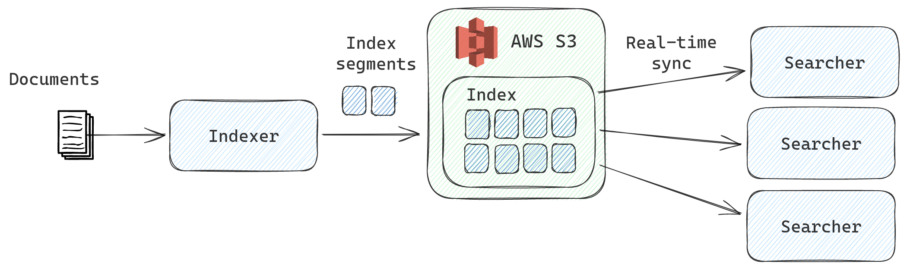

# Nixiesearch: neural search engine for the rest of us

[](https://github.com/nixiesearch/nixiesearch/actions)
[](https://opensource.org/licenses/Apache-2.0)


# What is Nixiesearch?

Nixiesearch is an experimental neural/hybrid/lexical *opinionated* search engine, focused on simplicity and developer UX: 
* **zero configuration**: batteries included, but everything is tunable.
* **state-of-the-art search quality**: [Lucene](https://lucene.apache.org/)-powered lexical retrieval, bi/cross-encoder 
retrieval and reranking. Hybrid search, combining both approaches with [RRF](https://plg.uwaterloo.ca/~gvcormac/cormacksigir09-rrf.pdf) 
and [LambdaMART Learn-to-Rank](https://xgboost.readthedocs.io/en/latest/tutorials/learning_to_rank.html).
* **cloud-native**: stateless searchers allow smooth auto-scaling on Kubernetes.
* **fine-tuned for your data**: fine-tune semantic search models like [E5](https://huggingface.co/intfloat/e5-base-v2) 
and [MiniLM-L6-v2](https://huggingface.co/sentence-transformers/all-MiniLM-L6-v2) for your data out-of-the-box.

But Nixiesearch is *not a yet another vector search engine*:
* **Supports facets, rich boolean filtering, sorting and autocomplete**: things you got used to in traditional search engines.
* **Text in, text out**: LLM embedding is handled by the search engine, not by you.
* **Exact-match search**: Nixiesearch is a hybrid retrieval engine searching over terms and embeddings. Your brand and SKU
queries will return what you expect, and not what LLM hallucinates about.

## Design

Nixiesearch is inspired by an Amazon search engine design described in a talk 
[E-Commerce search at scale on Apache Lucene](https://www.youtube.com/watch?v=EkkzSLstSAE):



Compared to a traditional search engines like ElasticSearch/Solr:
* **Independent stateful indexer and stateless search backends**: with index sync happening via S3-compatible block storage.
No more red index status and cluster split-brains due to indexer overload.
* **Pull-based indexing**: pull updated documents right from [Kafka](https://kafka.apache.org/) in real-time, no need for
separate indexing ETL jobs with limited throughput.

## Limitations

Nixiesearch is not a general-purpose search engine like Elasticsearch:
* **No sharding support** (yet): so it's not made for logs and APM data. Indices up to 5M docs are OK.
* **May require GPU**: computing embeddings for large search corpora during indexing is a compute-intensive task and may take
a lot of resources if run on CPU. And GPU is a must for a model fine-tuning. 

## Usage

Config file example is below. All fields are optional and Nixiesearch can deduce index mapping for non-existent
indices from incoming documents, so it can work without configuration file altogether:

```yaml
api:
  host: localhost
  port: 8080
store:
  remote: "s3://bucket/prefix"
  local: "file://var/lib/nixiesearch"
index:
  helloworld:
    fields:
      id:
        type: text
        search: false # just a stored field. all fields are stored by-default
      title:
        type: text
        search: semantic
      desc:
        type: text
        search: # more advanced setup
          type: semantic
          model: intfloat/e5-base-v2
          language: english
      price:
        type: int # can be also float/long/double
        filter: true # all numeric fields are filterable
        facet: true # and facetable by default when auto-detected
        sort: true
```

For search requests, the API is inspired (but not compatible) by Elasticsearch:
```
POST /helloworld/_search
{
  "query": {
    "multi_match": {
      "query": "meaning of life", 
      "fields": ["title", "desc"] 
    }
  }
}
```

## Current status

As for August 2023, Nixiesearch is in the process of active development, please don't even try to run 
it if you're not a contributor. Current roadmap for an MVP:

- [x] Search/Index API
- [x] Index mapping
- [x] Config file parsing
- [x] Lexical search with Lucene
- [ ] S3 index sync
- [ ] Semantic bi-encoder search
- [ ] LLM fine-tuning

License
=====
This project is released under the Apache 2.0 license, as specified in the [License](LICENSE) file.
