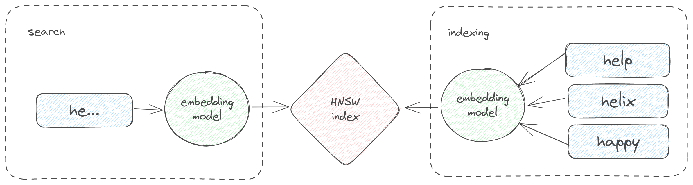

# Autocomplete Suggestions

Unlike traditional Lucene-based search enignes, Nixiesearch uses a novel semantic autocomplete suggestions algorithm:



Nixiesearch uses an in-house LLM for generating embeddings [nixiesearch/nixie-suggest-small-v1](https://huggingface.co/nixiesearch/nixie-suggest-small-v1) that is based on [intfloat/e5-small-v2](https://huggingface.co/intfloat/e5-small-v2) with the following improvements:

* Can tolerate multiple types of typos: letter drops, letter swaps, letter duplications and partial inputs. For example, cosine distance between terms `milk` and `mikl` is quite small.
* Fine-tuned on a task of recovering full term based on a noisy prefix. For example, cosine distance between `termi` and `terminator` is minimal. Prefix can also include typos.

Compared to traditional algorithmic approaches, the semantic one:

* Can use **semantics of surrounding words** while matching. Example: `mkli coffee` has too huge Levenstein distance in the first word for Lucene FuzzySuggester to handle the issue, but it's quite clear from the semantics of the phrase that it's probably a `milk coffee`
* **Not limited to prefix matching** and specific thresholds (like 1-2) of edit distances unlike other solutions: `mollk coffee` is still close to `milk coffee` even with edit distance of 3.
* Can handle **fully semantic matches** like `cappucino` being close to `milk coffee`.

To create a suggestion index, you need to:

* Create a static [suggestion index mapping](#creating-a-suggestions-indexg). Unlike existing Lucene search engines, Nixiesearch suggest index is not tied to a specific *suggestable* field. Suggest index is just a special flavor of a regular semantic index. At the moment, we do not support dynamic mapping for suggestion indices.
* [Add suggestion documents](#indexing-predefined-suggestion-strings) to the index. Only documents you've indexed will be returned in the response.
* Send a [search suggestion request](#sending-suggestion-requests). Generated suggestions can also be [deduplicated](../reference/api/suggest.md#suggestion-deduplication) to group similar ones.

## Creating a suggestions index

Nixiesearch only supports explicit suggestion index mapping, so to index suggestions, you need to define a [custom suggestions index](../reference/api/suggest.md#suggestion-index-mapping) in a configuration file:


```yaml
suggest:
  <suggester-index-name>:
    model: nixiesearch/nixie-suggest-small-v1
```

Unlike existing Lucene-based search engines, you need to explicitly ingest documents for suggestions into the autocomplete index:

* [Index raw suggestion strings as-is](#indexing-predefined-suggestion-strings). Useful when you want to only include a special vetted set of strings into the suggestion index, like historical search queries.
* [Transform your existing documents](#indexing-transformed-documents). Take existing documents, and expand their fields into suggestion strings.

### Indexing predefined suggestion strings

When you already have a set of pre-made suggestions for indexing (for example, based on a set of previously searched queries or product titles), Nixiesearch expects [documents with a single `"suggest"`](../reference//api/suggest.md#raw-suggestion-without-transformations) field as a source of suggestions:

```json
{"suggest": "hello"}
{"suggest": "help"}
{"suggest": "helps"}
{"suggest": "hip hop"}
```

> Suggestion JSON format is the same as for [regular search documents](../reference//api/index/document-format.md).

Indexing can be performed with a cURL command in the same way as for regular documents indexing:

```shell
curl -XPUT -d @suggestions.json http://localhost:8080/<index-name>/_index
```

### Indexing documents

Instead of preparing suggestion strings by yourself, you can generate suggestions by [indexing your regular documents](../reference/api/suggest.md#transforming-existing-documents-for-suggestions). To make this, you need to mark suggestable fields in your index mapping:

```yaml
suggest:
  <suggester-index-name>:
    model: nixiesearch/nixie-suggest-small-v1
    transform:
      fields: [title, description]
```

With the mapping above you can `_index` the same set of documents as for regular search. Nixiesearch will extract `title` and `description` text fields from these documents, generate suggestions and index them.

> As suggestion index is a separate index with different format and semantics, you need to index your documents twice: one time for regular search, and second time for autocomplete suggestions.

A more detailed list of supported transformations is available in the [Suggestion API](../reference/api/suggest.md#transforming-existing-documents-for-suggestions) reference section. 

## Sending suggestion requests

Suggest indices have a special [`_suggest` endpoint](../reference//api/suggest.md#sending-suggestion-requests) you can use for autocomplete suggestion generation that performs a k-NN vector search over the index to find similar suggestions.

```shell
curl -XPOST -d '{"text": "hel"}' http://localhost:8080/<index-name>/_suggest
```

It will emit the following response:

```json
{
  "suggestions": [
    {
      "text": "helps", 
      "score": 0.95, 
      "forms": [{"text": "help", "score": 0.90}] 
    },
    {
      "text": "hello",
      "score": 0.90,
      "forms": []
    }
  ]
}
```

Suggestion API also supports deduplication of results, see [suggestion deduplication](../reference/api/suggest.md#suggestion-deduplication) reference section for details.