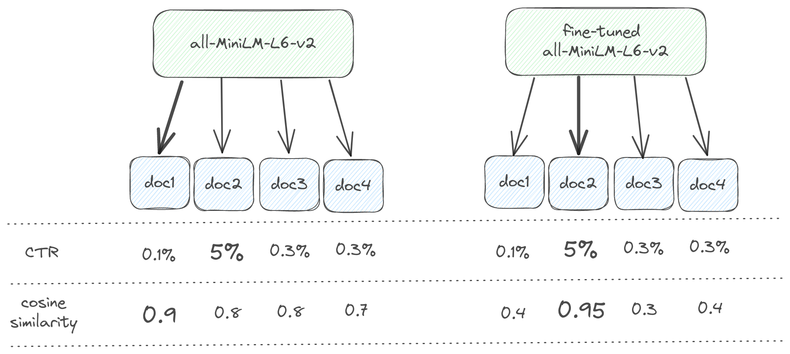
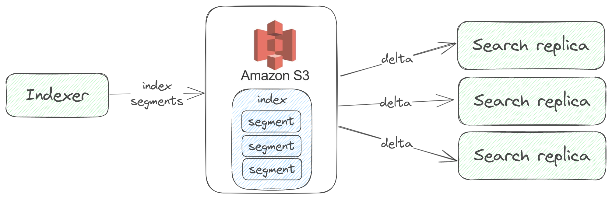

# How Nixiesearch is different?

Nixiesearch was built from the ground up solving typical and practical problems of large-scale semantic search engines:

* **Semantic search is bad at exact matches, lexical search struggles with semantics**. Nixiesearch takes best from both approaches by combining them in a single [hybrid way of doing search](#hybrid-search).
* **Precision of a semantic search engine heavily depends on embedding model**. But in practice customer intent is not equal to vector similarity: is "milk chocolate" relevant for "milk" query? Nixiesearch allows you to [fine-tune the embedding LLM](#llm-fine-tuning) to incorporate customer feedback directly into the underlying index.
* Indexing and re-indexing large collections of documents is a challenging task when you only have a **push-based** REST API and need to ingest documents carefully not to overload your production cluster. Nixiesearch separates indexing backend into a separate service, which can [pull data from Kafka/S3](#pull-based-indexing) with the maximal throughput and zero impact on search workload.
* Distributed cluster state makes **load-based auto-scaling of existing search engines challenging**. Nixiesearch uses [S3 block storage for index synchronization](#s3-index-storage-and-auto-scaling), allowing seamless k8s-native autoscaling. 

## Hybrid search

Nixiesearch transparently uses two Lucene-powered search indices for both lexical and semantic search, combining search results into a single list with [Reciprocal Rank Fusion](../reference/api/search/query.md#rrf-reciprocal-rank-fusion):

Compared to just a single lexical or semantic search approach:

* hybrid search allows combining best of two worlds: being able to [perform exact match searches](../reference/api/search/query.md#hybrid-semantic-and-lexical-search) over keywords, but at the same time retrieving documents with similar context.
* [RRF ranking](../reference/api/search/query.md#rrf-reciprocal-rank-fusion) requires almost zero configuration for reasonably good results while mixing search results from different indices.

## LLM fine-tuning

> This feature is in development and planned for the v0.1 release.

Embedding-based semantic search is a great way to increase search recall: it will match all the similar documents based on the search query even when there are no keyword matches. But in practice a customer expects good enough precision of top-N results, and a good balance between precision and recall is important.

Nixiesearch can incorporate an explicit customer feedback about search relevance directly into the embedding LLM by [fine-tuning it](../reference/cli/finetune.md):

Two main sources of relevance labels can be used as a customer feedback:

1. Explicit relevance judgments made by human raters. You can use open-source tools like [Quepid](https://quepid.com/) and SaaS platforms like [Toloka.ai](https://toloka.ai/search-relevance/) and [Amazon MTurk](https://www.mturk.com/) to build such datasets.
2. Implicit judgments made from aggregating real customer behavior, based on query-document CTR and Conversion rates.

Using customer feedback, you can teach the underlying LLM which documents are truly relevant in your particular case.

## Pull-based indexing

> This feature is in development and planned for the v0.1 release.

Existing search engines require you to build a satellite indexing app, which pushes documents to the search engine:

* indexer should maintain back-pressure not to write too many documents to overflow the internal indexing queue. Queue overflow may cause a search cluster node crash and affect normal search operations. And writing too few documents means a suboptimal indexing throughput.
* you should also implement a re-indexing to re-process all the documents in a case of incompatible index mapping change.

Architecturally, your app pushes documents to the search engine and maintains the best rate.

In comparison, Nixiesearch is a [pull-based system](../reference/cli/index.md):

* it pulls the next document batch immediately when indexing resources became available. This approach allows to have a perfect resource utilization and the most optimal indexing throughput.
* it does not have an internal indexing queue, so there is no way to overflow it.
* no need for a specialized indexing app with complicated back-pressure logic. You can use Kafka topic or a set of files on S3 block storage as a source of documents.

> Nixiesearch can emulate a push-based indexing behavior using a traditional [indexing API](../reference/api/index/ingestion.md), but a pull-based approach is recommended.

## S3 index storage and auto-scaling

> This feature is in development and planned for the v0.1 release.

Distributed cluster state is the most complicated part of existing search engines:

* Re-balance of a large index is an expensive and fragile operation due to large amount of data shuffled through the network.
* A subtle bug in consensus algorithm may result in a [split-brain](https://www.slideshare.net/DilumBandara/cap-theorem-and-split-brain-syndrome) scenarios and incur data loss.

Nixiesearch used an S3-compatible block storage (like [AWS S3](https://aws.amazon.com/s3/), [Google GCS](https://cloud.google.com/storage) and [Azure Blob Storage](https://azure.microsoft.com/en-us/products/storage/blobs)) for index synchronization, which greatly simplifies cloud operations:

* Search replicas can now be spawned immediately, as there is no need to node-to-node data transfers. No need to have persistent volumes for your k8s Pods. Complete index can be loaded from the object storage, allowing you to have **seamless load-based auto-scaling**.
* As indexer runs separately from Search replicas, it is possible to have a **scale-to-zero autoscaling**: search backend can be spawned as a lambda function only when there is an incoming search request. 