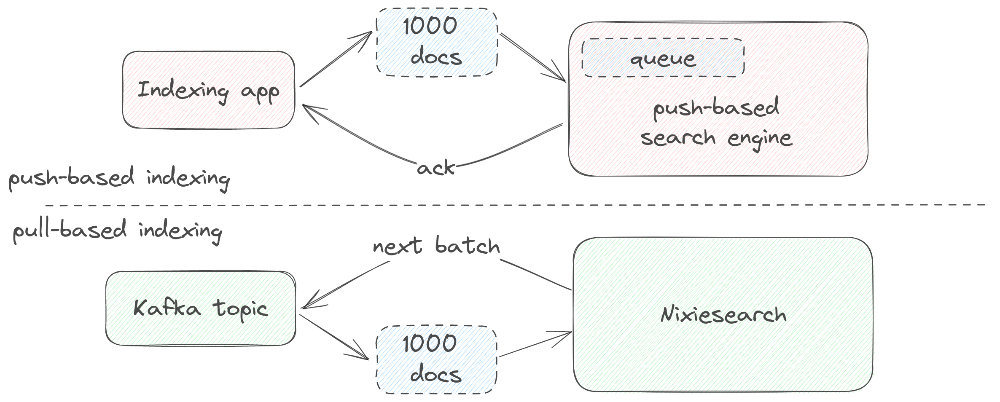

# Building an index

Nixiesearch index is a searchable group of documents sharing the same structure. 

To add a set of documents to an index, you need to perform two steps:

* define an [index mapping](#index-mapping) either [statically in a config file](#static-index-mapping), or [dynamically](#dynamic-index-mapping) - let Nixiesearch figure out the best mapping based on documents you write.
* write documents to the index, either with push-based REST API or with pull-based stream ingestion.

## Index mapping

There are two ways of creating an index mapping:

* defining a [static index mapping](index.md#static-index-mapping) in a config file, when you manually define which fields your documents have, their types and how they are going to be searched. This allows more control over the way documents are stored and searched, but unfortunately requires reading this documentation.
* ingesting your [JSON documents](../reference/api/index/document-format.md) as-is without any mapping, and make Nixiesearch deduce the [dynamic index mapping](index.md#dynamic-index-mapping) on the fly from your documents format.

## Dynamic index mapping

Dynamic mapping deduces subjectively the best way of storing your documents in the index based on its [JSON structure](../reference/api/index/document-format.md):

* **flat documents** are mapped as is to index fields.
* **arrays** are different from singular fields, and use different underlying data structures.
* **nested documents** are flattened.

For example, the following document:

```json
{
  "_id": 1,
  "title": "socks",
  "colors": ["red", "black"],
  "price": 100.0,
  "meta": {"asin": "AAA123"},
  "variants": [
    {"id": "v1", "name": "long socks"},
    {"id": "v2", "name": "short socks"}
  ]
}
```

Will generate this mapping:
```yaml
search:
  my-index:
    fields:
      - title:
        type: text
      - colors: 
        type: text[]
      - price:
        type: float
      - meta.asin: # flattened into a non-repeated nested field
        type: text
      - variants.id: # as it's an array of documents,
        type: text[] # flattened into a text[] field
      - variants.name:
        type: text[]
```

To see how Nixiesearch generates mappings for your documents, you can hit the `GET /<index>/_mapping` endpoint after indexing a single document:

```bash
curl -XPUT -d '{"title": "a", "color": ["red"], "meta": {"asin":"a"}}'\
  http://localhost:8080/dev/_index
```

And after that, you can query the generated mapping with the following command:

```bash
curl http://localhost:8080/dev/_mapping
```

which for the sample document above will emit a nice mapping in a JSON format (shortened for better readability) you can use without writing a config file with an explicit one:

```json
{
  "name": "dev",
  "fields": {
    "color": {
      "type": "text[]",
      "name": "color"
    },
    "meta.asin": {
      "type": "text",
      "name": "meta.asin"
    },
    "title": {
      "type": "text",
      "name": "title"
    },
    "_id": {
      "type": "text",
      "name": "_id",
      "search": { "type": "disabled" }
    }
  }
}
```

### Problems of dynamic mapping

Nixiesearch is not perfect in deducing a proper mapping and makes a lot of conservative assumptions about how documents are going to be accessed later.

* Each detected text field is marked as searchable, [facetable](../reference/api/search/facet.md) and [filterable](../reference/api/search/filter.md). Each of these features requires a lot of underlying storage and compute, so statically enabling these will save you **a lot** of resources.
* All the fields in the JSON document are mapped to fields, even the ones not later used for search. Explicit mapping allows you to omit unused fields.
* Deduced types are not always perfect. It's not possible to distinguish a specific numeric type (int/float/long/double) from the JSON payload, so we always use double.

To alleviate all such issues, for any non-playground deployment prefer the static index mapping.

## Static index mapping

To define a static index mapping, you need to add an index-specific block to the `search` section of the [configuration file](../reference/config/mapping.md):

```yaml
search:
  my-first-index:
    fields:
      title:
        type: text
      price:
        type: float 
```

In the example above we defined an index `my-first-index` with two fields title and price.

Each field definition in a static mapping has two groups of settings:

* Field type specific parameters - like how it's going to be searched for text fields.
* Global parameters - is this field filterable, facetable and sortable.

Go to [the mapping reference](../reference/config/mapping.md) section for more details on all parameters.

## Writing documents to an index

Internally Nixiesearch implements a pull-based indexing - the service itself asks for a next chunk of documents from an upstream system. 



For convenience, Nixiesearch can emulate a push-based approach via REST API - your app should send a payload with documents and wait for an acknowledgement.

### Indexing REST API

Each Nixiesearch index has an `_index` REST endpoint where you can [HTTP PUT](https://developer.mozilla.org/en-US/docs/Web/HTTP/Methods/PUT) your documents to.

This endpoint expects a JSON payload in [one of the following formats](../reference/api/index/document-format.md):

* JSON object: just a single document.
* JSON array of objects: a batch of documents.
* JSON-Line array of objects: also a batch of documents, but simpler wire format.

For example, writing a single document to an index can be done with a cURL command:

```bash
curl -XPUT -d '{"title": "hello", "color": ["red"], "meta": {"sku":"a123"}}'\
  http://localhost:8080/dev/_index
```

> As Nixiesearch deliberately has no indexing queue, it asynchronously blocks till all the documents in the submitted batch were indexed. You should avoid doing HTTP PUT's with too large payloads and instead split them into smaller batches of 100-500 documents.

### Streaming document indexing

> This feature is still in development and part of v0.1 roadmap

With pull-based streaming indexing it becomes trivial to support these typical scenarios:

1. **Batch full re-indexing**: take all documents from a datasource and periodically re-build index from scratch.
2. **Distributed journal as a single source of truth**: use [Kafka compacted topics](https://developer.confluent.io/courses/architecture/compaction/) as a view over last versions of documents, with real-time updates.
3. **Large dataset import**: import a complete set of documents from local/S3 files, maintaining optimal throughput and batching.


 Nixiesearch supports [Apache Kafka](https://kafka.apache.org/), [AWS S3](https://aws.amazon.com/s3/) (and also compatible object stores) and local files as a source of documents for indexing.
 
If you have your dataset in a JSON file, instead of making HTTP PUT with very large payload using REST API, you can invoke a `nixiesearch index` sub-command to perform streaming indexing in a separate process:

```shell
docker run -i -t -v <your-local-dir>:/data nixiesearch/nixiesearch:latest index\
  --config /data/conf.yml --index <index name> --source file:///data/docs.json
```

Where `<your-local-dir>` is a directory containing the `conf.yml` config file and a `docs.json` with documents for indexing.