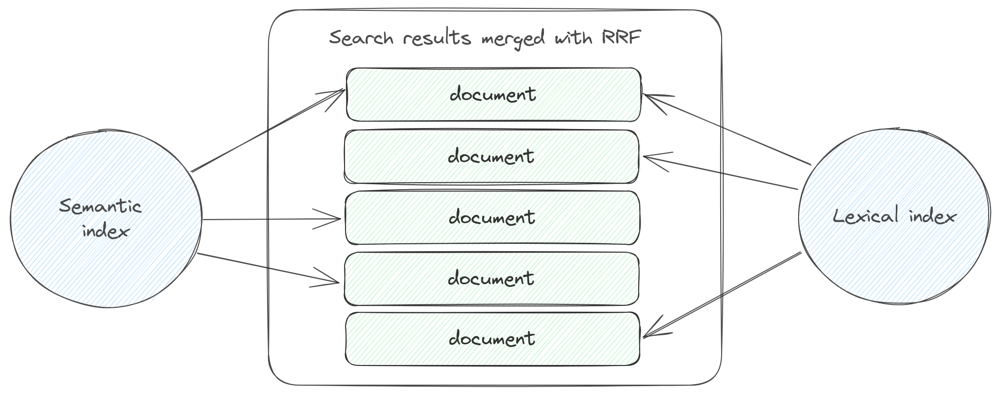

# Search

To search for documents indexed in Nixiesearch, you can use the following [request JSON format](../reference/api/search/request.md):

```json
{
  "query": {
    "multi_match": {
      "fields": ["<search-field-name>", "<search-field-name>"],
      "query": "<query-string>"
    }
  }
}
```

Where:

* `<search-field-name>`: a text field marked as [searchable in the index mapping](../reference/config/mapping.md)
* `<query-string>`: a string to search for.

Check more examples of [Query DSL](../reference/api/search/query.md) in the reference.

For such a search request, Nixiesearch will reply with a JSON response with top-N matching documents:

```json
{
  "took": 100,
  "hits": [
    {"_id": "1", "title": "hello", "_score": 2},
    {"_id": "2", "title": "world", "_score": 1}
  ]
}
```

`_id` and `_score` are built-in fields always present in the payload. 

> Compared to Elasticsearch/Opensearch, Nixiesearch has no built-in `_source` field as it is frequently mis-used. You need to explicitly mark fields you want to be present in response payload as `store: true` in the [index mapping](../reference/config/mapping.md).

## RRF: Reciprocal Rank Fusion

When you search over multiple fields marked as [semantic](../../config/mapping.md) and [lexical](../../config/mapping.md), or over a [hybrid](../../config/mapping.md) field, Nixiesearch dows the following:

1. Collects a separate per-field search result list.
2. Merges N search results with RRF - [Reciprocal Rank Fusion](#TODO).



RRF merging approach:

* Does not use a document score directly (so BM25 or cosine-distance), but a document position in a result list when sorted by the score.
* Scores of documents from multiple lists are combined together.
* Final ranking is made by sorting merged document list by the combined score.

Compared to traditional methods of combining multiple BM25 and cosine scores together, RRF does not depend on the scale and statistical distribution of the underlying scores - and can generate more stable results.

## Filters

To select a sub-set of documents for search, add `filters` directive to the [request JSON payload](../reference/api/search/request.md):

```json
{
  "query": {
    "match_all": {}
  },
  "filters": {
    "include": {
      "term": {
        "field": "color",
        "value": "red"
      }
    }
  }
}
```
Nixiesearch supports the following set of filter types:

* [Term filters](../reference/api/search/filter.md#term-filters) - to match over text fields.
* [Range filters](../reference/api/search/filter.md#range-filters) - to select over numeric `int`/`long`/`float`/`double` fields.
* [Compound boolean filters](../reference/api/search/filter.md#boolean-filters) - to combine multiple filter types within a single filter predicate.

See [Filters DSL](../reference/api/search/filter.md) reference for more examples and details. 

## Facets

Facet count aggregation is useful for building a [faceted search](https://en.wikipedia.org/wiki/Faceted_search): for a search query apart from documents, response contains also a set of possible filter values (sorted by a number of documents this filter value will match).

A [JSON search request](../reference/api/search/request.md) payload can be extended with the `aggs` parameter:

```json
{
  "query": {
    "multi_match": {}
  },
  "aggs": {
    "count_colors": {
      "term": {
        "field": "color",
        "count": 10
      }
    }
  }
}
```

Where `count_colors` is an aggregation name, this is a `term` aggregation over a field `color`, returning top-`10` most frequent values for this field.

Each facet aggregation adds an extra named section in the search response payload:

```json
{
  "hits": [
    {"_id": "1", "_score": 10},
    {"_id": "1", "_score": 5},
  ],
  "aggs": {
    "count_colors": {
      "buckets": [
        {"term": "red", "count": 10},
        {"term": "green", "count": 5},
        {"term": "blue", "count": 2},
      ]
    }
  }
}
```

See a [Facet Aggregation DSL](../reference/api/search/facet.md) section in reference for more details.