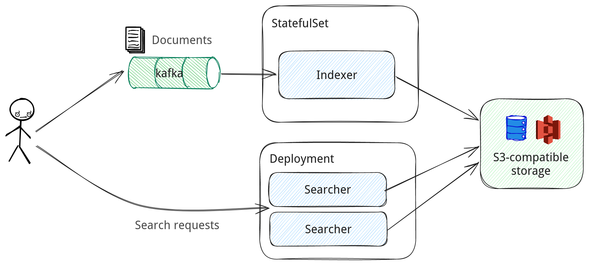

# Pull-based document ingestion with Apache Kafka

When run in a [distributed mode](../../index.md), Nixiesearch can pull documents for indexing from an [Apache Kafka](https://kafka.apache.org/) topic:

* Kafka can be used as a journal for [CDC-style](https://www.confluent.io/learn/change-data-capture/) events: every time a document changes in your master database, an event is emitted with an updated document.
* To preserve infinitely-growing topics, you can use [Compacted Topics](https://docs.confluent.io/kafka/design/log_compaction.html) to prune stale document records.



As for Nixiesearch v0.1, only [Apache Kafka](https://kafka.apache.org/) and [S3/local files](../../../reference/cli/index.md#offline-indexing) are supported for pull-based indexing. We have [Apache Pulsar]() (see issue [nixiesearch#190](https://github.com/nixiesearch/nixiesearch/issues/190)) and [AWS Kinesis](https://aws.amazon.com/kinesis/data-streams/) (see issue [nixiesearch#207](https://github.com/nixiesearch/nixiesearch/issues/207)) on the roadmap.

## Configuration

All Kafka-specific connector options should be passed as command-line flags to the [nixiesearch index kafka](../../../reference/cli/index.md#offline-indexing) subcommand:

```
  -b, --brokers  <arg>    Kafka brokers endpoints, comma-separated list
  -c, --config  <arg>     Path to a config file
  -g, --group_id  <arg>   groupId identifier of consumer. default=nixiesearch
  -i, --index  <arg>      to which index to write to
  -l, --loglevel  <arg>   Logging level: debug/info/warn/error, default=info
  -o, --offset  <arg>     which topic offset to use for initial connection?
                          earliest/latest/ts=<unixtime>/last=<offset>
                          default=none (use committed offsets)
      --options  <arg>    comma-separated list of kafka client custom options
  -t, --topic  <arg>      Kafka topic name
  -h, --help              Show help message
```

`brokers`, `index` and `topic` options are required.

The following options are optional:
* group_id: a name of consumer group.
* offset: a time window in which events are read:
    * `earliest` - start from the first stored message in the topic
    * `latest` - consume only events that came recently (after Metarank connection)
    * `ts=<timestamp>` - start from a specific absolute timestamp in the past
    * `last=<duration>` - consume only events that happened within a defined relative duration (duration supports the
      following patterns: `1s`, `1m`, `1h`, `1d`)
* options: a comma-separated list of custom connector options:
  * example: `--options key1=value1,key2=value2` 