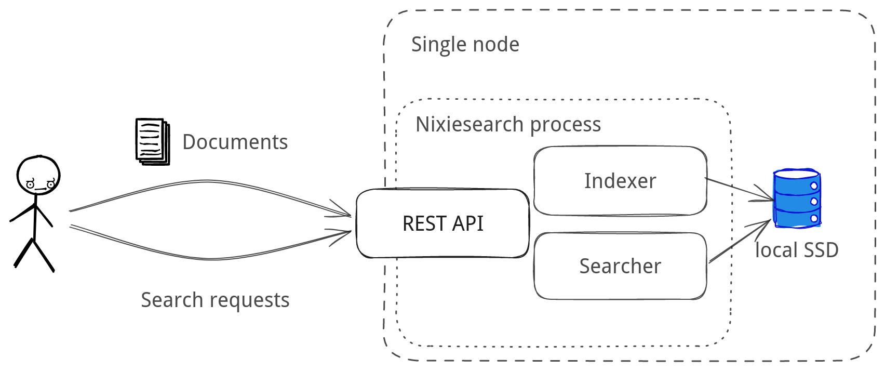
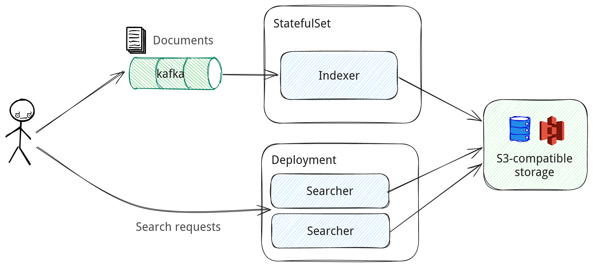

# Deployment

Nixiesearch is distributed as a [single Docker container](../quickstart.md#prerequisites) (with a special flavors for CPU and [GPU inference](distributed/gpu.md)) and can be deployed as a regular dockerized app:

* **[Standalone](#standalone)**: simple single-node install with [Docker](https://hub.docker.com/r/nixiesearch/nixiesearch/tags), with search and index API colocated within a single process. Recommended for dev environments and installs with no need for fault tolerance.
* **[Distributed](#distributed)**: distributed setup with separate indexer and searcher services, backed by S3-compatible block storage. Recommended for large and fault-tolerant installs.

## Standalone

In standalone mode searcher and indexer are colocated on a single Nixiesearch process:



Standalone mode is easy to start as it enforces a set of simplifications for the setup:

* only [REST API based document indexing](../api.md) is possible. 
* [S3-based index sync](distributed/persistence/index.md) is not enabled.

To start nixiesearch in a standalone mode, use the [nixiesearch standalone](../reference/cli/standalone.md) subcommand (where `config.yml` is an [index mapping configuration file](../features/indexing/mapping.md)):

```shell
docker run -i -t -v <data dir>:/data/ -p 8080:8080 nixiesearch/nixiesearch:latest\
  standalone --config config.yml
```

## Distributed

For production installs Nixiesearch can be rolled out in a distributed manner:

* separate searchers and indexer. Potentially searchers can be auto-scaled, and even scaled to zero.
* sync between indexer and searchers happens via S3-compatible block storage.



Nixiesearch has separate [nixiesearch index](../reference/cli/index.md) and [nixiesearch search](../reference/cli/search.md) sub-commands to run these sub-tasks.

Helm chart for smooth k8s deployment is planned for v0.3.

