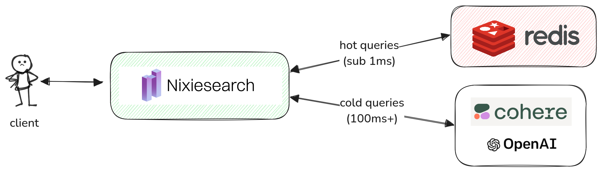

# Embedding cache

Computing [local SBERT-compatible](sbert.md) and [API-based](openai.md) embeddings is latency-heavy task. Nixiesearch can cache hot queries in in-memory and remote Redis-based cache. This approach:

* minimises end-to-end search latency, as query embedding can take up to 300ms for API-based embedding providers.
* reduces costs, as most frequent queries are never re-embedded.



## In-memory cache

In-memory caching is a default option. It is defined per-model in the `inference` section of [config file](../../../reference/config.md#embedding-models).

```yaml
inference:
  embedding:
    # Used for semantic retrieval
    e5-small:
      model: nixiesearch/e5-small-v2-onnx
      cache:
        memory:
          max_size: 32768
```

Cache can be disabled altogether:

```yaml
inference:
  embedding:
    # Used for semantic retrieval
    e5-small:
      model: nixiesearch/e5-small-v2-onnx
      cache: false
```

Cache is local to the node and is ephemeral (so is not persisted between restarts). If Nixiesearch runs in a [standalone mode](../../../deployment/standalone.md) (e.g. when indexing and search tiers are co-located in a single process), the cache is shared between indexing and search threads. 

## Redis cache

Planned in [Nixiesearch 0.6](https://github.com/nixiesearch/nixiesearch/issues/503). 