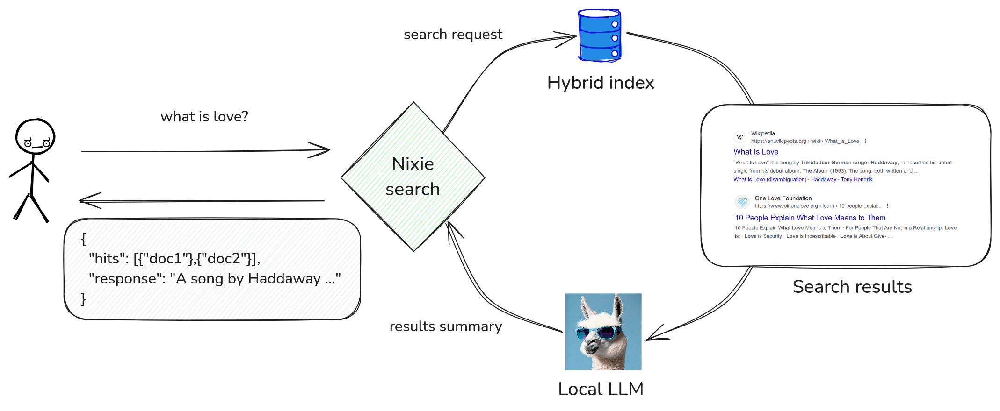
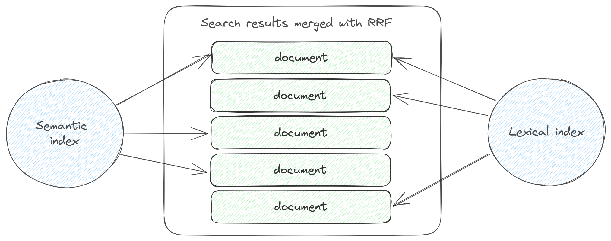

# Search

To search for documents indexed in Nixiesearch, you can use the following [request JSON format](query/overview.md#search-request-format):

```json
{
  "query": {
    "multi_match": {
      "fields": ["<search-field-name>", "<search-field-name>"],
      "query": "<query-string>"
    }
  }
}
```

Where:

* `<search-field-name>`: a text field marked as [searchable in the index mapping](../indexing/mapping.md)
* `<query-string>`: a string to search for.
* `multi_match`: one of the matching DSL rules. Check more examples of [Query DSL](query/overview.md) in the reference.

For such a search request, Nixiesearch will reply with a JSON response with top-N matching documents:

```json
{
  "took": 100,
  "hits": [
    {"_id": "1", "title": "hello", "_score": 2},
    {"_id": "2", "title": "world", "_score": 1}
  ]
}
```

`_id` and `_score` are built-in fields always present in the document payload.

!!! note

    Compared to Elasticsearch/Opensearch, Nixiesearch has no built-in `_source` field as it is frequently mis-used. You need to explicitly mark fields you want to be present in response payload as `store: true` in the [index mapping](../indexing/mapping.md).

## RAG: Retrieval Augmented Generation

Instead of just getting search results for your query, you can use a [RAG](https://en.wikipedia.org/wiki/Retrieval-augmented_generation) approach to get a natural language answer to your query, built with locally-running LLM.



Nixiesearch supports any GGUF-compatible LLM [llamacpp](https://github.com/ggerganov/llama.cpp) supports. To use RAG, you need to [list Huggingface handles of models](rag.md) you'd like to use in the [`inference` section of the config file](../../reference/config.md#ml-inference):

```yaml
inference:
  embedding:
    # Used for semantic retrieval
    e5-small:
      model: intfloat/e5-small-v2
  completion:
    # Used for summarization
    qwen2:
      provider: llamacpp
      model: Qwen/Qwen2-0.5B-Instruct-GGUF
      file: qwen2-0_5b-instruct-q4_0.gguf

schema:
  movies:
    fields:
      title:
        type: text
        search: 
          semantic:
            model: e5-small
      overview:
        type: text
        search: 
          semantic:
            model: e5-small
```

Here we use a [Qwen/Qwen2-0.5B-Instruct-GGUF](https://huggingface.co/Qwen/Qwen2-0.5B-Instruct-GGUF) model with explicitly defined filename (as there may be multiple GGUF model files in the repo).

> LLM inference on a CPU is a tough task, expect much higher latencies for RAG requests, compared to regular ones.

After that we can send RAG search requests to our index:

```json
{
  "query": {
    "multi_match": {
      "fields": ["title", "description"],
      "query": "what is pizza"
    }
  },
  "rag": {
    "prompt": "Summarize search results for a query 'what is pizza'",
    "model": "qwen2",
    "fields": ["title", "description"]
  }
}
```

For this query, Nixiesearch will perform following actions:
* Make a search for the query `what is pizza` over `title` and `description` fields
* pick top-N matching documents from results, and build an LLM prompt:
```
Summarize search results for a query 'what is pizza':

[1]: Pizza is a traditional Italian dish typically consisting of ...

[2]: One of the simplest and most traditional pizzas is the Margherita ...

[3]: The meaning of PIZZA is a dish made typically of flattened bread dough ...
```
* stream generated response among search results:

```json
{
  "took": 10,
  "hits": [
    {"_id": 1, "title": "...", "description":  "..."},
    {"_id": 1, "title": "...", "description":  "..."},
    {"_id": 1, "title": "...", "description":  "..."}
  ],
  "response": "Pizza is a dish of Italian origin ..."
}
```

As LLM inference is a costly operation, Nixiesearch supports a WebSocket response streaming: you immediately get search result documents in a first frame, and LLM-generated tokens are streamed while being generated. See [RAG reference](rag.md) for more details.


## Hybrid search with Reciprocal Rank Fusion

When you search over [text fields](../indexing/types/text.md) marked as both `lexical` and `semantic` search capable in the index mapping, you can use the [`rrf`](query/rank/rrf.md) [ranking](query/overview.md) operator to fuse two search results into a single result list:


```shell
curl -XPOST http://localhost:8080/v1/index/movies/search \
  -H "Content-Type: application/json" \
  -d '{ 
    "query": {
      "rrf": {
        "queries": [
          {"match": {"title": "batman"}},
          {"semantic": {"title": "batman nolan"}}
        ],
        "rank_window_size": 20
      } 
    }, 
    "fields": ["title"], 
    "size": 5
  }'
```

While performing hybrid search, Nixiesearch does the following:

1. Collects a separate per-field search result list for semantic and lexical retrieval methods.
2. Merges N search results with RRF - [Reciprocal Rank Fusion](https://dl.acm.org/doi/10.1145/1571941.1572114).



RRF merging approach:

* Does not use a document score directly (so BM25 or cosine-distance), but a document position in a result list when sorted by the score.

For even better relevance, you can combine RRF results with [cross-encoder reranking](query/rank/ce.md) to get neural-powered relevance scoring on top of hybrid retrieval.
* Scores of documents from multiple lists are combined together.
* Final ranking is made by sorting merged document list by the combined score.

Compared to traditional methods of combining multiple BM25 and cosine scores together, RRF does not depend on the scale and statistical distribution of the underlying scores - and can generate more stable results.

See the [RRF ranker](query/rank/rrf.md) section for more details.

## Filters

To select a sub-set of documents for search, add `filters` directive to the [request JSON payload](query/overview.md#search-request-format):

```json
{
  "query": {
    "match_all": {}
  },
  "filters": {
    "include": {
      "term": {
        "field": "color",
        "value": "red"
      }
    }
  }
}
```
Nixiesearch supports the following set of filter types:

* [Term filters](filter.md#term-filters) - to match over text fields.
* [Range filters](filter.md#range-filters) - to select over numeric `int`/`long`/`float`/`double`/`bool` fields.
* [Compound boolean filters](filter.md#boolean-filters) - to combine multiple filter types within a single filter predicate.

See [Filters DSL](filter.md) reference for more examples and details.

!!! note

    A field should be defined as `filter: true` to be used in filter expressions.

## Facets

Facet count aggregation is useful for building a [faceted search](https://en.wikipedia.org/wiki/Faceted_search): for a search query apart from documents, response contains also a set of possible filter values (sorted by a number of documents this filter value will match).

A [JSON search request](query/overview.md#search-request-format) payload can be extended with the `aggs` parameter:

```json
{
  "query": {
    "multi_match": {}
  },
  "aggs": {
    "count_colors": {
      "term": {
        "field": "color",
        "count": 10
      }
    }
  }
}
```

Where `count_colors` is an aggregation name, this is a `term` aggregation over a field `color`, returning top-`10` most frequent values for this field.

Each facet aggregation adds an extra named section in the search response payload:

```json
{
  "hits": [
    {"_id": "1", "_score": 10},
    {"_id": "1", "_score": 5},
  ],
  "aggs": {
    "count_colors": {
      "buckets": [
        {"term": "red", "count": 10},
        {"term": "green", "count": 5},
        {"term": "blue", "count": 2},
      ]
    }
  }
}
```

!!! note

    A field should be marked as `facet: true` to be used in facet aggregations.

See a [Facet Aggregation DSL](facet.md) section in reference for more details.