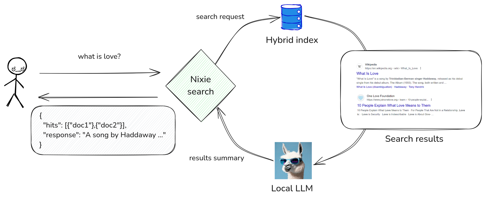

# RAG: Retrieval Augmented Generation

Nixiesearch supports [RAG](https://en.wikipedia.org/wiki/Retrieval-augmented_generation)-style question answering over fully local LLMs:



To use RAG queries, you need to explcitly define in the config file which LLMs you plan to use query-time:

```yaml
schema:
  movies:
    rag:
      models:
        - handle: Qwen/Qwen2-0.5B-Instruct-GGUF?file=qwen2-0_5b-instruct-q4_0.gguf
          prompt: qwen2
          name: qwen2
    fields:
      title:
        type: text
        search: semantic
        suggest: true
      overview:
        type: text
        search: semantic
        suggest: true
```

Where:
* `handle`: a Huggingface model handle in a format of `namespace`/`model-name`. Optionally may include a `?file=` specifier in a case when model repo contains multiple GGUF files. By default Nixiesearch will pick the lexicographically first file.
* `prompt`: a prompt format, either one of pre-defined ones like `qwen2` and `llama3`, or a raw prompt with `{user}` and `{system}` placeholders.
* `name`: name of this model you will reference in RAG search requests
* `system` (optional): A system prompt for the model.

## Supported prompts

A `qwen2` prompt, which is in fact an alias to the following raw prompt:
```
<|im_start|>user\n{user}<|im_end|>\n<|im_start|>assistant\n
```

A more extended `llama3` prompt is an alias to the next raw one:
```
<|start_header_id|>system<|end_header_id|>

{system}<|eot_id|><|start_header_id|>user<|end_header_id|>

{user}<|eot_id|><|start_header_id|>assistant<|end_header_id|>

```

You can always define your own prompt:
```yaml
schema:
  movies:
    rag:
      models:
        - handle: TheBloke/Mistral-7B-Instruct-v0.2-GGUF
          prompt: "[INST] {user} [/INST]"
          name: mistral7b
```

## Sending requests

For RAG requests, Nixiesearch supports REST and WebSocket protocols:
* REST: much simpler to implement, but blocks till full RAG response is generated.
* WebSocket: can stream each generated response toke, but more complex.

Request format is the same for both protocols:

```json
{
  "query": {
    "multi_match": {
      "fields": ["title", "description"],
      "query": "what is pizza"
    }
  },
  "fields": ["title", "description"],
  "rag": {
    "prompt": "Summarize search results for a query 'what is pizza'",
    "model": "qwen2"
  }
}
```

The `rag` field has the following options:
* `prompt` (string, required): A main instruction for the LLM.
* `model` (string, required): Model name from the `rag.models` [index mapping section](#rag-retrieval-augmented-generation).
* `fields` (string[], optional): A list of fields from the search results documents to embed to the LLM prompt. By default, use all stored fields from the response.
* `topDocs` (int, optional): How many top-N documents to embed to the prompt. By default pick top-10, more documents - longer the context - higher the latency.
* `maxDocLength` (int, optional): Limit each document in prompt by first N tokens. By default, use first 128 tokens.
* `maxResponseLength` (int, optional): Maximum number of tokens LLM can generate. Default 64.

## REST responses

A complete text of the LLM response you can find in a `response` field:

```shell
$> cat rag.json

{
  "query": {
    "multi_match": {
      "fields": ["title"],
      "query": "matrix"
    }
  },
  "fields": ["title"],
  "rag": {
    "prompt": "Summarize search results for a query 'matrix'",
    "model": "qwen2"
  }
}

$> curl -v -XPOST -d @rag.json http://localhost:8080/movies/_search

{
  "took": 3,
  "hits": [
    {
      "_id": "604",
      "title": "The Matrix Reloaded",
      "_score": 0.016666668
    },
    {
      "_id": "605",
      "title": "The Matrix Revolutions",
      "_score": 0.016393442
    },
  ],
  "aggs": {},
  "response": "The following is a list of search results for the query 'matrix'. It includes the following:\n\n- The matrix is the first film in the \"Matrix\" franchise."
}
```

## Websocket responses

The main REST search endpoint `/<index_name>/_search` can also function as a WebSocket endpoint. With a simple Python based WS client you can send websocket requests to this endpoint:

```python
import websocket
import json

websocket.enableTrace(True)

def on_message(wsapp, message):
    print(message)

def on_open(wsapp):
    query = {
        "id": "some-unique-request-id",
        "query": {
            "multi_match": {
                "fields": ["title"],
                "query": "matrix"
            }
        },
        "fields": ["title"],
        "rag": {
            "prompt": "Summarize search results for a query matrix",
            "model":"qwen2",
            "maxResponseLength":10
        }
    }
    wsapp.send(json.dumps(query))
endpoint = "ws://localhost:8080/movies/_search"
ws = websocket.WebSocketApp(endpoint, on_message=on_message, on_open=on_open)

ws.run_forever() 
```

WebSocket response can be one of the following two frame types:

* `results`: regular search results JSON payload as for REST endpoint
* `rag`: a follow-up sequence of rag responses, frame per token, emitted while LLM inference is in progress.

### `results` frame

A `results` frame has the following structure:

```json
{
  "results": {
    "id": "some-unique-request-id",
    "took": 112,
    "hits": [
      {
        "_id": "604",
        "title": "The Matrix Reloaded",
        "_score": 0.016666668
      },
      {
        "_id": "605",
        "title": "The Matrix Revolutions",
        "_score": 0.016393442
      }
    ],
    "ts":1722354191905
  }
}
```

* `results` (required, Response): a search results payload.
* `results.id` (optional, String): a parent search request id.

As Websocket is asynchronous protocol, in practice you can send multiple parallel search requests to the same Websocket endpoint, and receive multiple interleaved response streams within a single channel. The request/response `id` field can be used to distinguish between these response streams.

> Note that unlike in the REST response, the `results.response` field is missing from the response payload: it is going to be streamed per token with the `rag` frames!

### `rag` frame

A `rag` frame is a tiny frame always following the `results` frame:

```json
{
  "rag": {
    "id": "some-unique-request-id",
    "token": " Matrix",
    "ts": 1722354192184,
    "took": 20,
    "last": false
  }
}
```

* `rag.id` (optional, string): a parent request id
* `rag.token` (required, string): next generated LLM token
* `rag.ts` (required, long): generation timestamp
* `rag.took` (required, long): how many millis underlying LLM spend generating this token
* `rag.last` (required, bool): is this the last token in the response stream?

### Assembling frames together

So a series of `results` and `rag` frames can be combined into a single stream in the following way:

```json
{"results":{"took":5,"hits":[{"_id":"604","title":"The Matrix Reloaded","_score":0.016666668},{"_id":"605","title":"The Matrix Revolutions","_score":0.016393442},{"_id":"157353","title":"Transcendence","_score":0.016129032},{"_id":"19995","title":"Avatar","_score":0.015873017},{"_id":"1538","title":"Collateral","_score":0.015625},{"_id":"264660","title":"Ex Machina","_score":0.015384615},{"_id":"1858","title":"Transformers","_score":0.015151516},{"_id":"1949","title":"Zodiac","_score":0.014925373},{"_id":"10681","title":"WALL·E","_score":0.014705882},{"_id":"766507","title":"Prey","_score":0.014492754}],"aggs":{},"id":"test1","ts":1722355042186}}
{"rag":{"id":"test1","token":"The","ts":1722355042502,"took":313,"last":false}}
{"rag":{"id":"test1","token":" Matrix","ts":1722355042518,"took":17,"last":false}}
{"rag":{"id":"test1","token":" Reload","ts":1722355042600,"took":82,"last":false}}
{"rag":{"id":"test1","token":"ed","ts":1722355042687,"took":86,"last":false}}
{"rag":{"id":"test1","token":":","ts":1722355042707,"took":21,"last":false}}
{"rag":{"id":"test1","token":" A","ts":1722355042759,"took":52,"last":false}}
{"rag":{"id":"test1","token":" novel","ts":1722355042778,"took":18,"last":false}}
{"rag":{"id":"test1","token":" adaptation","ts":1722355042801,"took":22,"last":false}}
{"rag":{"id":"test1","token":" of","ts":1722355042815,"took":16,"last":false}}
{"rag":{"id":"test1","token":" the","ts":1722355042833,"took":18,"last":false}}
{"rag":{"id":"test1","token":"","ts":1722355042834,"took":1,"last":true}}```
```
* The `results` frame with search results is always the first one
* If there was a `request.rag` field present in the search request, server will start streaming RAG response tokens
* When server finishes generating RAG response, it will set `last: true` flag to communicate that.