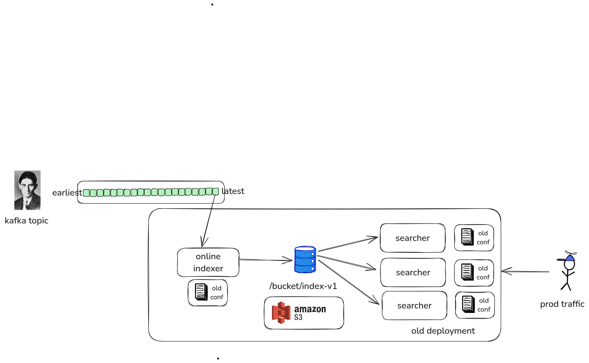

# Nixiesearch: batteries included search engine


[](https://github.com/nixiesearch/nixiesearch/actions)
[](https://opensource.org/licenses/Apache-2.0)


[](https://communityinviter.com/apps/nixiesearch/nixiesearch)
[](https://demo.nixiesearch.ai)

## What is Nixiesearch?

Nixiesearch is a **modern search engine** that runs on [S3-compatible storage](deployment/distributed/persistence/s3.md). We built it after dealing with the headaches of running large Elastic/OpenSearch clusters (here's the [blog post full of pain](https://nixiesearch.substack.com/p/nixiesearch-running-lucene-over-s3)), and here’s why it’s awesome:

* **Powered by [Apache Lucene](https://lucene.apache.org)**: You get support for [39 languages](reference/languages.md), [facets](features/search/facet.md), [advanced filters](features/search/filter.md), [autocomplete suggestions](features/autocomplete/index.md), and the familiar [sorting](features/search/sort.md) features you’re used to.
* **Decoupled [S3-based](deployment/distributed/persistence/s3.md) storage and compute**: There's nothing to break. You get risk-free [backups](tutorial/backup.md), [upgrades](tutorial/upgrade.md), [schema changes](tutorial/schema.md) and [auto-scaling](tutorial/autoscaling.md), all on a stateless index stored in S3.
* **Pull indexing**: Supports both offline and online incremental indexing using an [Apache Spark based ETL process](features/indexing/overview.md). No more POSTing JSON blobs to prod cluster (and overloading it).
* **No state inside the cluster**: All changes (settings, indexes, etc.) are just [config](reference/config.md) updates, which makes [blue-green deployments](tutorial/schema.md) of index changes a breeze.
* **AI batteries included**: fully local [Embedding](features/inference/embeddings.md) and [LLM inference](features/inference/completions.md), first class [RAG API](features/search/rag.md) support.


Search is never easy, but Nixiesearch has your back. It takes care of the toughest parts—like reindexing, capacity planning, and maintenance—so you can save time (and your sanity).

!!! note 
    Want to learn more? Go straight to the [quickstart](https://www.nixiesearch.ai/quickstart/) and check out [the live demo](https://demo.nixiesearch.ai).

## What Nixiesearch is not?

* **Nixiesearch is not a database**, and was never meant to be. Nixiesearch is a search index for consumer-facing apps to find top-N most relevant documents for a query. For analytical cases consider using good old SQL with [Clickhouse](https://github.com/ClickHouse/ClickHouse) or [Snowflake](https://www.snowflake.com/en/).
* **Not a tool to search for logs**. Log search is about throughput, and Nixiesearch is about relevance. If you plan to use Nixiesearch as a log storage system, please don't: consider [ELK](https://www.elastic.co/elastic-stack) or [Quickwit](https://github.com/quickwit-oss/quickwit) as better alternatives.

## The difference

> Our elasticsearch cluster has been a pain in the ass since day one with the main fix always "just double the size of the server" to the point where our ES cluster ended up costing more than our entire AWS bill pre-ES [ [HN source] ](https://news.ycombinator.com/item?id=30791838)

When your search cluster is red again when you accidentally send a wrong JSON to a wrong REST endpoint, you can just write your own S3-based search engine like big guys do:

* **Uber**:  [Lucene: Uber’s Search Platform Version Upgrade](https://www.uber.com/en-NL/blog/lucene-version-upgrade/).
* **Amazon**: [E-Commerce search at scale on Apache Lucene](https://www.youtube.com/watch?v=EkkzSLstSAE).
* **Doordash**: [Introducing DoorDash’s in-house search engine](https://careers.doordash.com/blog/introducing-doordashs-in-house-search-engine/).


Nixiesearch was inspired by these search engines, but is fully [open-source](#license) (with no paid addons and enterprise tier). Decoupling search and storage makes ops simpler. Making your search configuration immutable makes it even more simple. 



How it's different from popular search engines?

* vs [Elastic](https://www.elastic.co/elasticsearch): [Embedding inference](features/inference/embeddings.md), [hybrid search](features/search/overview.md#hybrid-search-with-reciprocal-rank-fusion) and [reranking](#) are free and open-source. For ES these are part of the [proprietary cloud](https://www.elastic.co/subscriptions/cloud).
* vs [OpenSearch](https://opensearch.org/): While OpenSearch can use [S3-based segment replication](https://opensearch.org/docs/latest/tuning-your-cluster/availability-and-recovery/segment-replication/index/), Nixiesearch can also offload cluster state to S3.
* vs [Qdrant](https://qdrant.tech/) and [Weaviate](https://weaviate.io/): Not a sidecar search engine to handle just vector search. [Autocomplete](features/autocomplete/index.md), [facets](features/search/facet.md), [RAG](features/search/rag.md) and [embedding inference](features/inference/embeddings.md) out of the box.


## Try it out

Get the sample [MSRD: Movie Search Ranking Dataset](https://github.com/metarank/msrd) dataset:

```shell
curl -Lo movies.jsonl https://nixiesearch.ai/data/movies.jsonl
```

```text
  % Total    % Received % Xferd  Average Speed   Time    Time     Time  Current
                                 Dload  Upload   Total   Spent    Left  Speed
100   162  100   162    0     0   3636      0 --:--:-- --:--:-- --:--:--  3681
100 32085  100 32085    0     0   226k      0 --:--:-- --:--:-- --:--:--  226k
```

Create an index mapping for `movies` index in a file `config.yml`:

```yaml
inference:
  embedding:
    e5-small: # (1)
      model: intfloat/e5-small-v2 # (2)
schema:
  movies: # index name
    fields:
      title: # field name
        type: text
        search: 
          lexical: # build lexical index
            analyze: english
          semantic: # and a vector search index also
            model: e5-small
        suggest: true
      overview:
        type: text
        search: false
```

1. We use [ONNX Runtime](https://onnxruntime.ai/) for local embedding inference. But you can also use any API-based SaaS embedding provider.
2. Any [SBERT](https://sbert.net/)-compatible embedding model can be used, and you can [bring your own](https://github.com/nixiesearch/onnx-convert)

Run the Nixiesearch [docker container](https://hub.docker.com/r/nixiesearch/nixiesearch):

```shell
docker run -itp 8080:8080 -v .:/data nixiesearch/nixiesearch:latest standalone -c /data/config.yml
```

If you see a cool ASCII-art logo, then the server is ready to serve requests:

```text
- Local index movies opened
- opening index movies
- ███╗   ██╗██╗██╗  ██╗██╗███████╗███████╗███████╗ █████╗ ██████╗  ██████╗██╗  ██╗
- ████╗  ██║██║╚██╗██╔╝██║██╔════╝██╔════╝██╔════╝██╔══██╗██╔══██╗██╔════╝██║  ██║
- ██╔██╗ ██║██║ ╚███╔╝ ██║█████╗  ███████╗█████╗  ███████║██████╔╝██║     ███████║
- ██║╚██╗██║██║ ██╔██╗ ██║██╔══╝  ╚════██║██╔══╝  ██╔══██║██╔══██╗██║     ██╔══██║
- ██║ ╚████║██║██╔╝ ██╗██║███████╗███████║███████╗██║  ██║██║  ██║╚██████╗██║  ██║
- ╚═╝  ╚═══╝╚═╝╚═╝  ╚═╝╚═╝╚══════╝╚══════╝╚══════╝╚═╝  ╚═╝╚═╝  ╚═╝ ╚═════╝╚═╝  ╚═╝
- version=0.5.0 jdk[build]=21.0.6+7-LTS jdk[runtime]=21+35-2513 arch=arm64 build=CPU
- JVM args: -Xmx1g -verbose:gc --add-modules=jdk.incubator.vector
-                                                                                
- Ember-Server service bound to address: [::]:8080
```

Let's submit the document corpus for indexing:

```shell
curl -XPOST -d @movies.jsonl http://localhost:8080/v1/index/movies
```

```json
{"result":"created","took":8256}
```

And send a hybrid search request mixing a lexical [match](features/search/query/retrieve/match.md) and [semantic](features/search/query/retrieve/semantic.md) query with the [RRF](features/search/query/rank/rrf.md) ranking:

```shell
curl -XPOST http://localhost:8080/v1/index/movies/search \
  -H "Content-Type: application/json" \
  -d '{ 
    "query": {
      "rrf": {
        "queries": [
          {"match": {"title": "batman"}},
          {"semantic": {"title": "batman nolan"}}
        ],
        "rank_window_size": 20
      } 
    }, 
    "fields": ["title"], 
    "size": 5
  }'
```

And you get a response:

```json
{
  "took": 8,
  "hits": [
    {
      "_id": "414906",
      "title": "The Batman",
      "_score": 0.033333335
    },
    {
      "_id": "272",
      "title": "Batman Begins",
      "_score": 0.032786883
    },
    {
      "_id": "209112",
      "title": "Batman v Superman: Dawn of Justice",
      "_score": 0.031257633
    },
    {
      "_id": "324849",
      "title": "The Lego Batman Movie",
      "_score": 0.031054404
    },
    {
      "_id": "155",
      "title": "The Dark Knight",
      "_score": 0.016129032
    }
  ],
  "aggs": {},
  "ts": 1745590503193
}
```

Nixiesearch can do much more, like [filtering](features/search/filter.md), [facets](features/search/facet.md), [autocomplete](features/autocomplete/index.md) and [RAG](features/search/rag.md) out of the box! For more details and more complex queries, see a complete [Quickstart guide](quickstart.md).


## License

This project is released under the Apache 2.0 license, as specified in the [License](https://github.com/nixiesearch/nixiesearch/blob/master/LICENSE) file.
