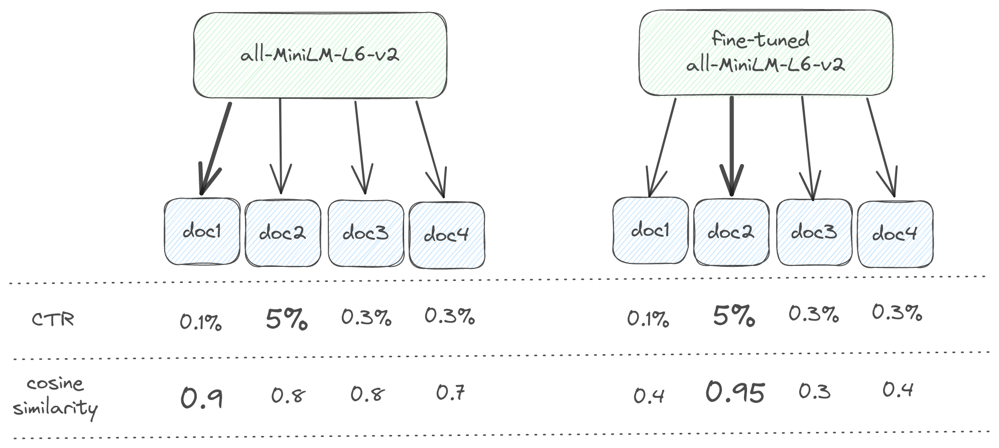
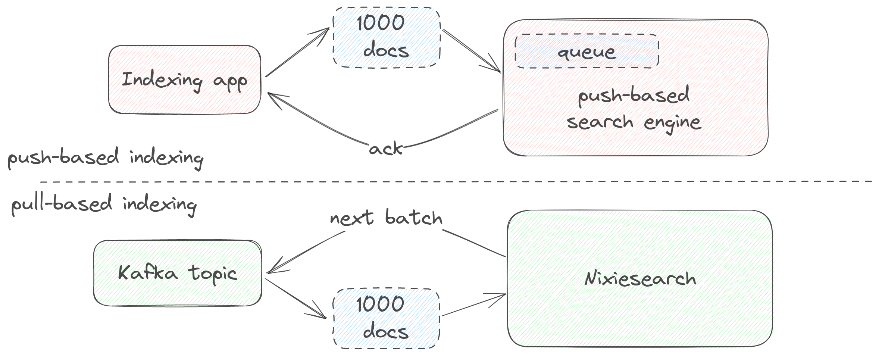
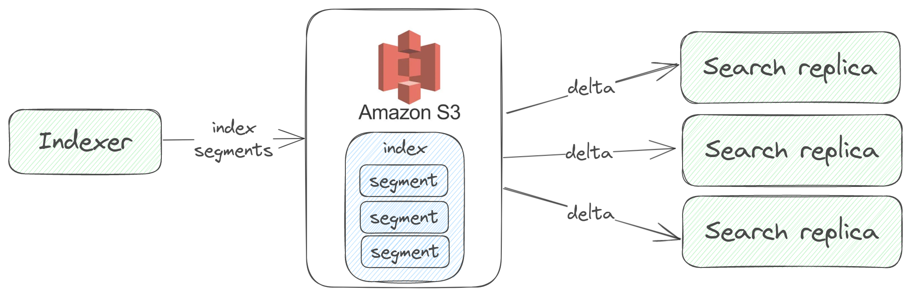

# Nixiesearch: batteries included search engine

[](https://github.com/nixiesearch/nixiesearch/actions)
[](https://opensource.org/licenses/Apache-2.0)


[](https://communityinviter.com/apps/nixiesearch/nixiesearch)
[](https://demo.nixiesearch.ai)

## What is Nixiesearch?

Nixiesearch is a **hybrid search engine** that fine-tunes to your data. 

* Designed to be cloud-native with [S3-compatible index persistence](deployment/distributed/persistence/s3.md). Distributed with stateless searchers and scale-to-zero. No more `status: red` on your cluster.
* Built on top of battle-tested [Apache Lucene](https://lucene.apache.org) library: [39 languages](reference/languages.md), [facets](features/search/facet.md), [advanced filters](features/search/filter.md), [autocomplete suggestions](features/autocomplete/index.md) and [sorting](features/search/sort.md) out of the box.
* Batteries included: [RAG queries](features/search/rag.md) and [vector search](reference/models/index.md) within a [single container](deployment/standalone.md) with a fully local CPU and [GPU inference](deployment/gpu.md). 
* Can learn the intent of a visitor by [fine-tuning an embedding model](https://github.com/nixiesearch/nixietune) to your data. Is "ketchup" relevant to a "tomato" query? It depends, but Nixiesearch can predict that from past user behavior.
> Want to learn more? Go straight to the [quickstart](https://www.nixiesearch.ai/quickstart/) and check out [the live demo](https://demo.nixiesearch.ai). 

### Why Nixiesearch?

Unlike Elastic/SOLR:

* Can run over [S3-compatible block storage](deployment/distributed/persistence/s3.md): Rapid auto-scaling (even down to zero!) and much easier operations (your index is just a directory in S3 bucket!)
* [RAG](features/search/rag.md),  [text](features/search/query.md) and [image](features/indexing/types/images.md) embeddings are first class search methods: no need for complex hand-written indexing pipelines.
* All LLM inference [can be run fully locally](reference/models/index.md) on CPU and [GPU](deployment/gpu.md), no need to send all your queries and private documents to OpenAI API. But [you can](reference/models/index.md), if you wish.

Unlike other vector search engines:

* **Supports [facets](features/search/facet.md), [rich filtering](features/search/filter.md), sorting and [autocomplete](features/autocomplete/index.md)**: things you got used to in traditional search engines.
* **Text in, text out**: [text embedding](reference/models/embedding.md) is handled by the search engine, not by you.
* **Exact-match search**: Nixiesearch is a hybrid retrieval engine searching over terms and embeddings. Your brand or SKU search queries will return what you expect, and not what the LLM hallucinates about.

The project is in active development and does not yet have backwards compatibility for configuration and data. Stay tuned and [reach out](https://www.metarank.ai/contact) if you want to try it!

### Why NOT Nixiesearch?

Nixiesearch has the following design limitations:

* **Does not support sharding**: sharding requires multi-node coordination and consensus, and we would like to avoid having any distributed state in the cluster - at least in the v1. If you plan to use Nixiesearch for searching 1TB of logs, please don't: consider [ELK](https://www.elastic.co/elastic-stack) or [Quickwit](https://github.com/quickwit-oss/quickwit) as better alternatives.
* **Query language is [simple](features/search/query.md)**: supporting analytical queries over deeply-nested documents is out of scope for the project. Nixiesearch is about consumer-facing search, and for analytical cases consider using [Clickhouse](https://github.com/ClickHouse/ClickHouse) or [Snowflake](https://www.snowflake.com/en/).

## Usage

Get the sample [MSRD: Movie Search Ranking Dataset](https://github.com/metarank/msrd) dataset:

```shell
curl -o movies.jsonl.gz https://nixiesearch.ai/data/movies.jsonl
```

```text
  % Total    % Received % Xferd  Average Speed   Time    Time     Time  Current
                                 Dload  Upload   Total   Spent    Left  Speed
100   162  100   162    0     0   3636      0 --:--:-- --:--:-- --:--:--  3681
100 32085  100 32085    0     0   226k      0 --:--:-- --:--:-- --:--:--  226k
```

Create an index mapping for `movies` index in a file `config.yml`:

```yaml
schema:
  movies: # index name
    fields:
      title: # field name
        type: text
        search: hybrid
        language: en # language is needed for lexical search
        suggest: true
      overview:
        type: text
        search: hybrid
        language: en
```

Run the Nixiesearch [docker container](https://hub.docker.com/r/nixiesearch/nixiesearch):

```shell
docker run -itp 8080:8080 -v .:/data nixiesearch/nixiesearch:latest standalone -c /data/config.yml
```

```text
a.nixiesearch.index.sync.LocalIndex$ - Local index movies opened
ai.nixiesearch.index.Searcher$ - opening index movies
a.n.main.subcommands.StandaloneMode$ - ███╗   ██╗██╗██╗  ██╗██╗███████╗███████╗███████╗ █████╗ ██████╗  ██████╗██╗  ██╗
a.n.main.subcommands.StandaloneMode$ - ████╗  ██║██║╚██╗██╔╝██║██╔════╝██╔════╝██╔════╝██╔══██╗██╔══██╗██╔════╝██║  ██║
a.n.main.subcommands.StandaloneMode$ - ██╔██╗ ██║██║ ╚███╔╝ ██║█████╗  ███████╗█████╗  ███████║██████╔╝██║     ███████║
a.n.main.subcommands.StandaloneMode$ - ██║╚██╗██║██║ ██╔██╗ ██║██╔══╝  ╚════██║██╔══╝  ██╔══██║██╔══██╗██║     ██╔══██║
a.n.main.subcommands.StandaloneMode$ - ██║ ╚████║██║██╔╝ ██╗██║███████╗███████║███████╗██║  ██║██║  ██║╚██████╗██║  ██║
a.n.main.subcommands.StandaloneMode$ - ╚═╝  ╚═══╝╚═╝╚═╝  ╚═╝╚═╝╚══════╝╚══════╝╚══════╝╚═╝  ╚═╝╚═╝  ╚═╝ ╚═════╝╚═╝  ╚═╝
a.n.main.subcommands.StandaloneMode$ -                                                                                
o.h.ember.server.EmberServerBuilder - Ember-Server service bound to address: [::]:8080
```

Build an index for a hybrid search:

```shell
curl -XPUT -d @movies.jsonl http://localhost:8080/movies/_index
```

```json
{"result":"created","took":8256}
```

Send the search query:

```shell
curl -XPOST -d '{"query": {"match": {"title":"matrix"}},"fields": ["title"], "size":3}'\
   http://localhost:8080/movies/_search
```

```json    
{
  "took": 1,
  "hits": [
    {
      "_id": "605",
      "title": "The Matrix Revolutions",
      "_score": 0.016666668
    },
    {
      "_id": "604",
      "title": "The Matrix Reloaded",
      "_score": 0.016393442
    },
    {
      "_id": "624860",
      "title": "The Matrix Resurrections",
      "_score": 0.016129032
    }
  ],
  "aggs": {},
  "ts": 1722441735886
}
```

You can also open `http://localhost:8080/movies/_ui` in your web browser for a basic web UI:


For more details, see a complete [Quickstart guide](quickstart.md).

## Design

Nixiesearch is inspired by an Amazon search engine design described in a talk
[E-Commerce search at scale on Apache Lucene](https://www.youtube.com/watch?v=EkkzSLstSAE):


Compared to traditional search engines like Elasticsearch/Solr:

* **Independent stateful indexer and stateless search backends**: with index sync happening via [S3-compatible block storage](deployment/distributed/persistence/s3.md).
  No more red index status and cluster split-brains due to indexer overload.
* **Pull-based indexing**: [pull updated documents](deployment/distributed/indexing/kafka.md) right from [Kafka](https://kafka.apache.org/) in real-time, no need for separate indexing ETL jobs with limited throughput.

Nixiesearch uses [RRF](https://plg.uwaterloo.ca/~gvcormac/cormacksigir09-rrf.pdf) for combining text and neural search results.

### Hybrid search

Nixiesearch transparently uses two Lucene-powered search indices for both lexical and semantic search, combining search results into a single list with [Reciprocal Rank Fusion](features/search/index.md#hybrid-search-with-reciprocal-rank-fusion):


Compared to just a single lexical or semantic search approach:

* hybrid search allows combining best of two worlds: being able to [perform exact match searches](features/search/index.md#search) over keywords, but at the same time retrieving documents with similar context.
* [RRF ranking](features/search/index.md#hybrid-search-with-reciprocal-rank-fusion) requires almost zero configuration for reasonably good results while mixing search results from different indices.

### LLM fine-tuning

!!! note

    This feature is in development and planned for the v0.3 release.

Embedding-based semantic search is a great way to increase search recall: it will match all the similar documents based on the search query even when there are no keyword matches. But in practice a customer expects good enough precision of top-N results, and a good balance between precision and recall is important.

Nixiesearch can incorporate explicit customer feedback about search relevance directly into the embedding LLM by [fine-tuning it](https://github.com/nixiesearch/nixietune):



Two main sources of relevance labels can be used as a customer feedback:

1. Explicit relevance judgments made by human raters. You can use open-source tools like [Quepid](https://quepid.com/) and SaaS platforms like [Toloka.ai](https://toloka.ai/search-relevance/) and [Amazon MTurk](https://www.mturk.com/) to build such datasets.
2. Implicit judgments made from aggregating real customer behavior, based on query-document CTR and Conversion rates.

Using customer feedback, you can teach the underlying LLM which documents are truly relevant in your particular case.

### Pull-based indexing

Existing search engines require you to build a satellite indexing app, which pushes documents to the search engine:

* indexer should maintain back-pressure not to write too many documents which can overflow the internal indexing queue. Queue overflow may cause a search cluster node crash and affect normal search operations. But writing too few documents means a suboptimal indexing throughput.
* you should also implement full re-indexing capability to re-process all the documents in a case of incompatible index mapping change.

Architecturally, your app pushes documents to the search engine and maintains the best rate.



In comparison, Nixiesearch is a [pull-based system](deployment/distributed/indexing/index.md):

* it pulls the next document batch immediately when indexing resources become available. This approach allows to have a perfect resource utilization and the most optimal indexing throughput.
* it does not have an internal indexing queue, so there is no way to overflow it.
* no need for a specialized indexing app with complicated back-pressure logic. You can use Kafka topic or a set of files on S3 block storage as a source of documents. 

!!! note

    Nixiesearch can emulate a push-based indexing behavior using a traditional [indexing API](features/indexing/api.md), but a pull-based approach is recommended.

### S3 index storage and auto-scaling

Distributed cluster state is the most complicated part of existing search engines:

* Re-balance of a large index is an expensive and fragile operation due to large amount of data shuffled through the network.
* A subtle bug in consensus algorithm may result in [split-brain](https://www.slideshare.net/DilumBandara/cap-theorem-and-split-brain-syndrome) scenarios and incur data loss.



Nixiesearch uses an S3-compatible block storage (like [AWS S3](https://aws.amazon.com/s3/), [Google GCS](https://cloud.google.com/storage) and [Azure Blob Storage](https://azure.microsoft.com/en-us/products/storage/blobs)) for index synchronization, which greatly simplifies cloud operations:

* Search replicas can now be spawned immediately, as there is no need for node-to-node data transfers. No need to have persistent volumes for your k8s Pods. Complete index can be loaded from the object storage, allowing you to have **seamless load-based auto-scaling**.
* As indexer runs separately from Search replicas, it is possible to have a **scale-to-zero autoscaling**: search backend can be spawned as a lambda function only when there is an incoming search request.


## Limitations

### Lack of sharding

Nixiesearch does not support index sharding out-of-the-box (but nothing stops you from implementing sharding client-side over multiple Nixiesearch clusters).

Main reason for this design decision is much simplified search replica coordination during auto-scaling: each replica always contains a complete copy of the index, there is no need to maintain a specific set of shard-replicas while up-down scaling.

### Low indexing throughput

As Nixiesearch computes text embeddings on a CPU by default, indexing large sets of documents is a resource-intensive task - as you need to embed all of them.

Nixiesearch implements multiple technical optimizations to make indexing throughput higher (like using ONNX runtime for running LLMs and caching embeddings for frequent text strings), but still expect a throughput of 100-500 documents per second.

### GPU needed for fine-tuning

Fine-tuning adapts an LLM to a specific training dataset, which requires running tens of thousands of forward-backward passes over a complete dataset. Fine-tuning can take 1-2 hours on a GPU, and can be unreasonably slow even on a fastest CPU.

In practice, CPU fine-tuning is 30x-50x slower than GPU one and can take multiple days instead of 1-2 hours.


# License

This project is released under the Apache 2.0 license, as specified in the [License](https://github.com/nixiesearch/nixiesearch/blob/master/LICENSE) file.
