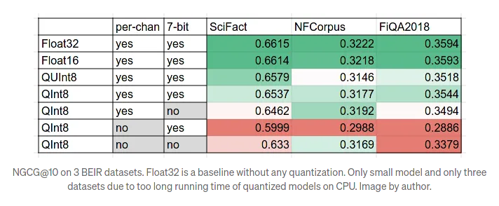

# Supported embedding models

Nixiesearch uses [ONNXRuntime](https://onnxruntime.ai/) to support the vast majority of embedding models you can see on the [MTEB](https://huggingface.co/spaces/mteb/leaderboard) leaderboard. 

## Huggingface model handles

You can reference any HF model handle in the text field index mapping block, for example:

```yaml
search:
  <index-name>:
    fields:
      desc:
        type: text
        search: 
          type: semantic
          model: nixiesearch/e5-small-v2-onnx
```

Optionally you can define which particular ONNX file to load, for example the QInt8 quantized one:

```yaml
search:
  <index-name>:
    fields:
      desc:
        type: text
        search: 
          type: semantic
          model: nixiesearch/e5-small-v2-onnx?modelFile=model_opt2_QInt8.onnx
```

## Converted models

We have a set of models converted to ONNX with the [nixiesearch/onnx-convert](https://github.com/nixiesearch/onnx-convert) tool available on our Huggingface repo at [huggingface.co/nixiesearch](http://huggingface.co/nixiesearch):

* nixiesearch/e5-base-v2-onnx: ONNX opset 17, optimized, QInt8 quantization
* nixiesearch/e5-small-v2-onnx: ONNX opset 17, optimized, QInt8 quantization
* nixiesearch/e5-large-v2-onnx: ONNX opset 17, optimized, QInt8 quantization

And multilingual ones:

* [nixiesearch/e5-base-v2-onnx](https://huggingface.co/nixiesearch/multilingual-e5-base-onnx): ONNX opset 17, optimized, QInt8 quantization
* [nixiesearch/e5-small-v2-onnx](https://huggingface.co/nixiesearch/multilingual-e5-small-onnx): ONNX opset 17, optimized, QInt8 quantization
* [nixiesearch/e5-large-v2-onnx](https://huggingface.co/nixiesearch/multilingual-e5-large-onnx): ONNX opset 17, optimized, QInt8 quantization

Check out the article in the blog on embedding performance and quantization for more details: [How to compute LLM embeddings 3X faster with model quantization](https://medium.com/nixiesearch/how-to-compute-llm-embeddings-3x-faster-with-model-quantization-25523d9b4ce5). The main executive summary is that quantized models are up to 3x faster than regular ones:


You should expect a small drop in ranking quality:



## Converting your own model

You can use the [nixiesearch/onnx-convert](https://github.com/nixiesearch/onnx-convert) to convert yur own model:

```bash
python convert.py --model_id intfloat/multilingual-e5-large --optimize 2 --quantize QInt8
```

```
Conversion config: ConversionArguments(model_id='intfloat/multilingual-e5-base', quantize='QInt8', output_parent_dir='./models/', task='sentence-similarity', opset=None, device='cpu', skip_validation=False, per_channel=True, reduce_range=True, optimize=2)
Exporting model to ONNX
Framework not specified. Using pt to export to ONNX.
Using the export variant default. Available variants are:
    - default: The default ONNX variant.
Using framework PyTorch: 2.1.0+cu121
Overriding 1 configuration item(s)
        - use_cache -> False
Post-processing the exported models...
Deduplicating shared (tied) weights...
Validating ONNX model models/intfloat/multilingual-e5-base/model.onnx...
        -[✓] ONNX model output names match reference model (last_hidden_state)
        - Validating ONNX Model output "last_hidden_state":
                -[✓] (2, 16, 768) matches (2, 16, 768)
                -[✓] all values close (atol: 0.0001)
The ONNX export succeeded and the exported model was saved at: models/intfloat/multilingual-e5-base
Export done
Processing model file ./models/intfloat/multilingual-e5-base/model.onnx
ONNX model loaded
Optimizing model with level=2
Optimization done, quantizing to QInt8
```